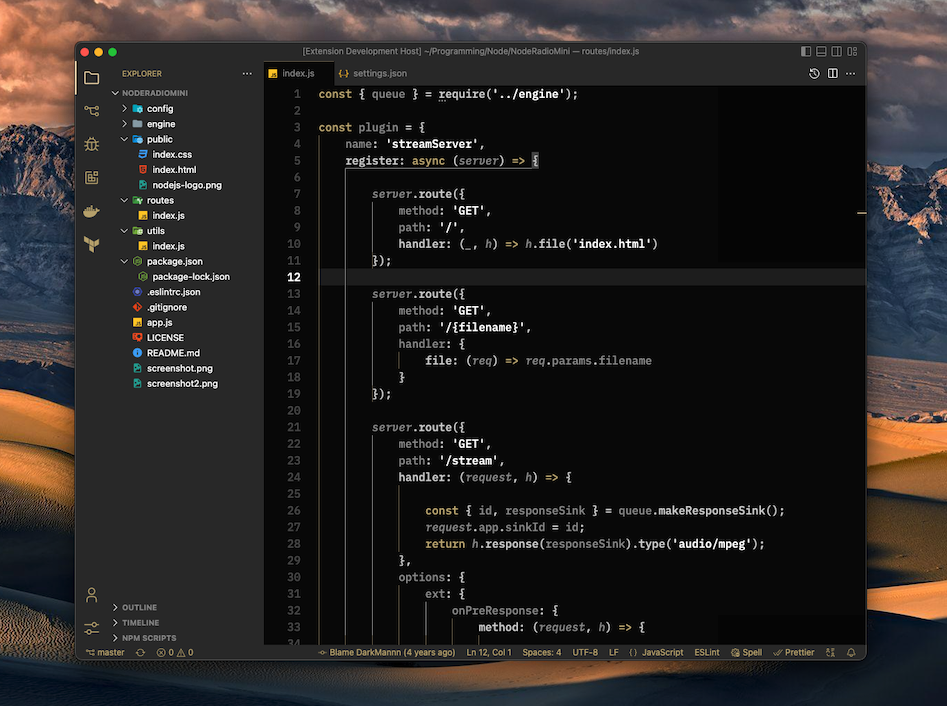

# Dark Sand Theme

A calming vscode color theme based on the colors of sand.

## Installation

1. Open the **Extensions** sidebar in VS Code. `View → Extensions`
1. Search for `Dark Sand Theme`, choose "Dark Sand Theme" by **DarkMannn**
1. Click **Install** to install it
1. Navigate to File > Preferences > Color Theme > **Dark Sand Theme**

## Contributing

Please report any issues [here](https://github.com/DarkMannn/dark-sand-vscode-theme/issues).

## License

This theme is released under the [MIT License](https://github.com/DarkMannn/dark-sand-vscode-theme/blob/main/LICENSE.md).

## Author

✨ Designed by **[DarkMannn](https://darkmannn.dev)**
